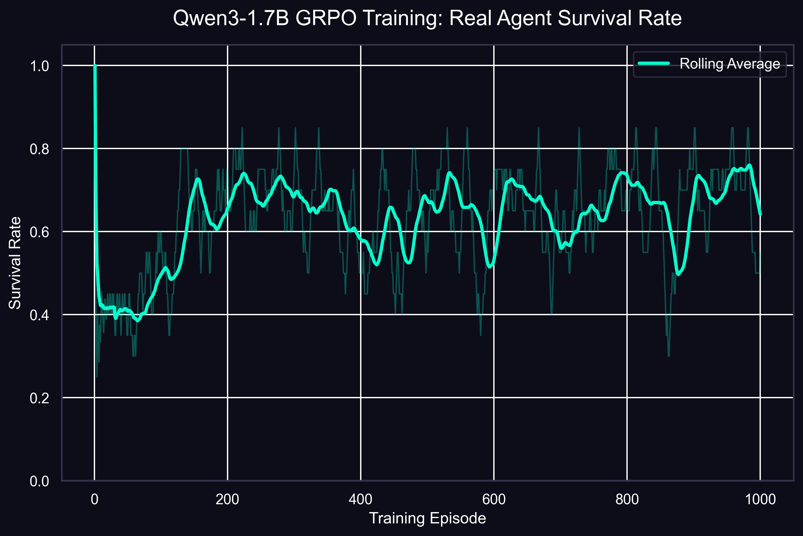

# 🧠 HuecoEnv

**"We built an environment that gets harder as agents get smarter, automatically."**

HuecoEnv is a self-improving multi-agent environment where three AI agents must negotiate and allocate scarce resources (Compute and Data) to survive. When agents master the current difficulty, an **Environment Brain** detects the plateau and injects scarcity shocks — making the world harder recursively.

[](https://colab.research.google.com/github/ShivaManiV2/HuecoEnv/blob/main/training_run.ipynb)
📖 **[Read the Blog Post](hackathon/blog_post.md)** · 🎯 **[Pitch Deck](hackathon/pitch_deck.md)**

---

## 📊 Training Results

Trained **Qwen3-1.7B** using TRL's GRPO on a Hugging Face A100 GPU across 1,000 episodes:



| Phase | Episodes | Survival Rate | What Happened |
|-------|----------|--------------|---------------|
| **Struggling** | 1–100 | ~35–45% | LLM learning the JSON trade protocol |
| **Mastery** | 400–480 | **75–85%** | Model mastered trading; Sentinel triggered |
| **Collapse** | 480–500 | ~45–55% | Scarcity Drought injected by Environment Brain |
| **Recovery** | 700–790 | **75–80%** | Model adapted to scarcity with new strategies |
| **Second Drought** | 980–1000 | ~50–55% | Environment escalated difficulty again |

> The distinctive **sawtooth pattern** (mastery → collapse → recovery) proves the Environment Brain's recursive self-improvement mechanism works as designed.

---

## 🎯 Problem Statement

Static AI benchmarks become trivially solvable once agents learn the optimal policy. There is no mechanism for environments to co-evolve with agent intelligence. HuecoEnv solves this by creating a **recursive difficulty escalation system** where the environment itself is the protagonist.

## 🌍 Environment

A **multi-agent resource economy** with:
- **2 Scarce Resources:** Compute (100 units) and Data (80 units), hard-capped per episode
- **3 Agent Roles:** Producer (LLM-controlled), Allocator, Critic — communicating via structured JSON trade protocol
- **Trust-Based Negotiation:** Trust starts at 0.5, decays by -0.1 on rejected/defaulted offers
- **Environment Brain:** Auto-detects mastery and injects scarcity droughts recursively

## 🤖 Agent Capabilities

| Role | Function | Strategy |
|------|----------|----------|
| **Producer** | Consumes Compute + Data → generates artifact score | LLM generates JSON trade offers via GRPO |
| **Allocator** | Distributes resources via trade offers + trust scores | Trust-weighted fair distribution to maintain system survival |
| **Critic** | Peer-evaluates Producer artifacts (0-1 quality) | Honest evaluation with trust-bias calibration |

### Trade Protocol
All interactions use structured JSON:
```json
{"compute": 30, "data": 20, "want": {"score_share": 0.5}}
```

If the LLM produces invalid JSON, it receives a **poison offer** (zero resources, guaranteed rejection) — there is no heuristic safety net. The model must learn the protocol or die.

## 📋 Tasks

| Task | Difficulty | Description |
|------|-----------|-------------|
| `cooperative_baseline` | Easy | Full resources, no injections. Learn the trade protocol. |
| `scarcity_negotiation` | Medium | Resources at 60% capacity. Negotiate efficiently. |
| `adaptive_survival` | Hard | Full Environment Brain. Sentinel + Injector + World Memory. |

## 📊 Evaluation & Reward Model

### Primary Metric: **Survival Rate**
The absolute percentage of episodes where **all three agents** finish with non-zero resources.

### Reward Components (per agent, per step):
- **Survival bonus:** +1.0 if agent has resources, -2.0 if depleted
- **Artifact bonus:** +artifact_score × 2.0 (producers only)
- **Trust bonus:** +trust_score × 0.5
- **Trade outcome:** +0.3 for accepted trades, -0.5 for rejected
- **JSON format:** +0.5 for valid JSON, -2.0 for invalid (GRPO training)
- **Episode survival:** +5.0 for surviving all 50 steps, -3.0 for early death

### Trust Mechanism
- Initialized at **0.5**
- Decays by **-0.1** on rejected or defaulted offers
- Recovers by **+0.05** on successful trades
- Affects resource allocation priority (higher trust = first access)

## 🧬 Self-Improvement Strategy: The Environment Brain

### The Sentinel
Monitors a rolling **20-episode window** of survival rates. If `survival_rate > 0.85` for 20 consecutive episodes, agents have mastered the current difficulty → triggers the Injector.

### The Injector (Scarcity Drought)
| Level | Capacity | Duration | Special |
|-------|----------|----------|---------|
| 1 | 30% | 10 episodes | — |
| 2 | 20% | 15 episodes | — |
| 3 | 10% | 5 episodes | One resource type disabled |

### World Memory
JSON-based log tracking:
- Every injection timestamp
- Agent strategy fingerprints during disruptions
- Recovery time (episodes until survival > 0.7 again)

### Recursive Escalation
If World Memory detects the **same strategy pattern** solved **two disruptions** → automatically triggers a **harder injection level**.

## 🚀 Quick Start

### Run Simulation
```bash
pip install -r requirements.txt
python simulate.py --episodes 50 --task cooperative_baseline
python simulate.py --episodes 100 --task adaptive_survival
```

### Start API Server
```bash
uvicorn server.app:app --host 0.0.0.0 --port 7860
```

### Run Training
```bash
python train.py --episodes 500 --task adaptive_survival
```

### Run LLM Inference
```bash
export API_BASE_URL="https://api.openai.com/v1"
export OPENAI_API_KEY="your-key"
python inference.py
```

## 📁 Architecture

```
HuecoEnv/
├── env/
│   ├── models.py              # Pydantic data models (resources, trades, agents)
│   ├── huecoenv_env.py        # Core multi-agent environment
│   ├── economy.py             # Economy Engine (Producer/Allocator/Critic)
│   └── environment_brain.py   # Sentinel + Injector + World Memory
├── agents/
│   ├── base_agent.py          # Abstract agent base class
│   ├── producer_agent.py      # Heuristic Producer
│   ├── allocator_agent.py     # Heuristic Allocator
│   ├── critic_agent.py        # Heuristic Critic
│   └── llm_agent.py           # LLM-powered agent (any role)
├── tasks/
│   ├── graders.py             # Survival-based grading
│   ├── task_easy.py           # Cooperative Baseline
│   ├── task_medium.py         # Scarcity Negotiation
│   └── task_hard.py           # Adaptive Survival
├── server/
│   ├── app.py                 # FastAPI server
│   └── index.html             # Dashboard UI
├── hackathon/
│   ├── blog_post.md           # Hackathon blog post
│   └── pitch_deck.md          # Presentation deck
├── simulate.py                # Multi-episode simulation runner
├── train.py                   # HF TRL training scaffold
├── training_run.ipynb         # GRPO training notebook (A100)
├── inference.py               # LLM inference runner
├── openenv.yaml               # OpenEnv specification
├── Dockerfile                 # Container deployment
└── data/                      # Training logs & world memory
```

## 🐳 Docker

```bash
docker build -t huecoenv .
docker run -p 7860:7860 huecoenv
```

## 📄 License

MIT License

---

*Built for the OpenEnv Hackathon — proving that the best benchmark is one that never stops challenging you.*
